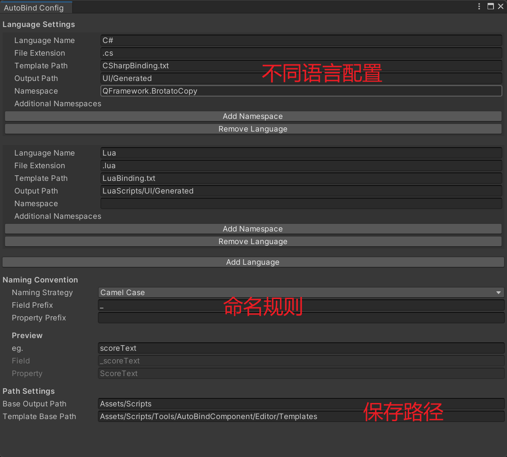

# AutoBindTool 自动绑定工具

## 简介
AutoBindTool 是一个 Unity 编辑器扩展工具，用于简化 UI 界面组件的绑定和引用过程。通过该工具，开发者可以直接在编辑器中拖拽 UI 组件，并自动生成对应的代码，避免手动编写大量的组件引用代码，提高开发效率。

## 主要功能
1. *组件自动绑定*：通过拖拽方式将 UI 组件绑定到 AutoBindComponent 组件上
2. *代码自动生成*：支持生成 C# 和 Lua 两种语言的绑定代码
3. *命名规则配置*：支持多种命名规则（驼峰命名法、帕斯卡命名法、匈牙利命名法）
4. *自定义模板*：可以根据项目需求自定义代码生成模板
5. *层级窗口标记*：在 Hierarchy 窗口中显示已绑定组件的标记
6. *组件丢失检测*：检测并提示已绑定但丢失的组件

## 使用方法
### 基本使用流程
1. 在 UI 界面的根物体上添加 AutoBindComponent 组件
2. 将需要引用的 UI 组件拖拽到组件的拖拽区域
3. 根据需要选择具体的组件类型（如 Button、Image、Text 等）
4. 点击生成代码按钮，生成对应的脚本文件

### 配置设置
在菜单栏 Tools/AutoBind/配置 中打开配置窗口，可以设置以下内容：

1. 语言设置：
    - 支持的语言类型（C#、Lua）
    - 文件扩展名
    - 模板路径
    - 输出路径
    - 命名空间
    - 附加命名空间
2. 命名规则：
    - 命名策略类型（驼峰命名法、帕斯卡命名法、匈牙利命名法）
    - 字段前缀
    - 属性前缀
3. 路径设置：
    - 基础输出路径
    - 模板基础路径

## 代码结构
### 核心组件
    - AutoBindComponent：运行时组件，用于存储和获取绑定的组件引用
    - AutoBindComponentEditor：编辑器扩展，提供拖拽和编辑功能
    - IBindingCodeGenerator：代码生成器接口
    - CSharpBindingGenerator：C# 代码生成器实现
    - LuaBindingGenerator：Lua 代码生成器实现
### 命名策略
    - INamingStrategy：命名策略接口
    - CamelCaseNamingStrategy：驼峰命名法实现
    - PascalCaseNamingStrategy：帕斯卡命名法实现
    - HungarianNamingStrategy：匈牙利命名法实现
### 配置系统
    - AutoBindGeneratorConfig：配置数据存储
    - AutoBindConfigWindow：配置编辑窗口
### 模板系统
工具使用文本模板来生成代码，支持以下模板变量：
- ${Namespace}：命名空间
- ${ClassName}：类名
- ${Fields}：字段定义
- ${BindingCode}：绑定代码
- ${UnBindingCode}：解绑代码
- ${TypeDefs}（仅Lua）：类型定义
- ${ClearCode}（仅Lua）：清理代码

## 注意事项
- 生成的代码使用 partial class（部分类）机制，不会覆盖已有的业务逻辑代码
- 使用前请确保已正确配置输出路径和命名空间
- 对于复杂的 UI 结构，建议按功能模块分别创建多个 AutoBindComponent

## 作者信息
作者：MuYiFC
创建日期：2025-03-09